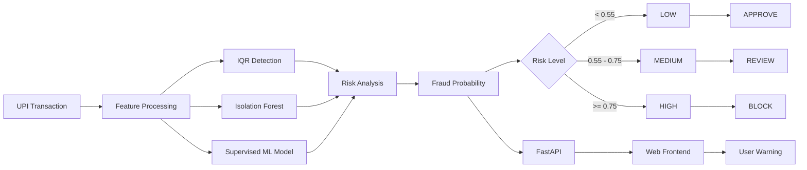
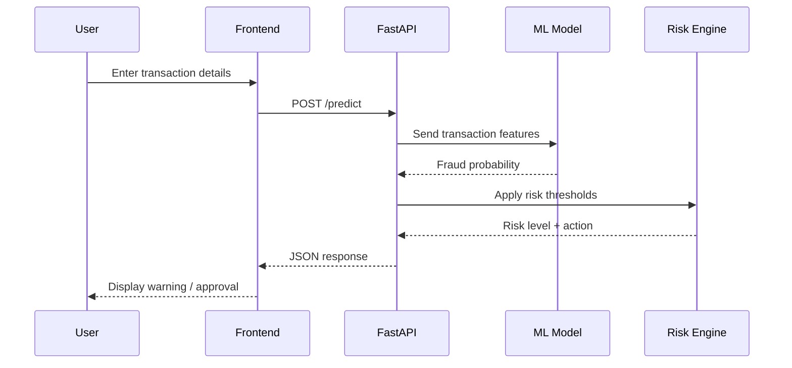

# 💳 UPI Fraud Detection & Real-Time Risk Engine

<p align="center">

### 🚨 Machine Learning Powered UPI Fraud Detection System

**Detect suspicious transactions • Quantify fraud risk • Provide real-time decisions**

</p>

---

## 📌 Overview

UPI has become one of the most widely used digital payment methods in India, making transaction security an important machine learning and engineering problem.

This project develops an **end-to-end UPI fraud detection system** that combines statistical anomaly detection, machine learning, a REST API, and a web-based interface to analyze transactions in real time.

The system is designed to answer a simple question:

> **"Should this transaction be approved, reviewed, or blocked?"**

Instead of relying on a single technique, the project explores multiple stages of fraud detection:

- 📊 Synthetic UPI transaction generation
- 📐 Statistical anomaly detection using **IQR**
- 🌲 Unsupervised anomaly detection using **Isolation Forest**
- 🤖 Supervised machine learning for fraud classification
- 📈 Model evaluation using Precision, Recall, F1 and ROC-AUC
- ⚡ Real-time inference through **FastAPI**
- 🖥️ Interactive frontend for transaction analysis
- 🚨 Automated risk-level and action generation

The final system converts a transaction into a practical decision:

```text
LOW     → APPROVE
MEDIUM  → REVIEW
HIGH    → BLOCK
```

---

# 🎯 Problem Statement

Digital payment fraud can occur when attackers exploit unusual transaction patterns such as:

- unusually large transaction amounts
- transactions at unusual hours
- repeated failed attempts
- newly created accounts
- unfamiliar devices
- unusual merchant categories
- suspicious combinations of transaction attributes

A fraud detection system therefore needs to identify transactions that differ significantly from normal user behavior.

The objective of this project is to build a system that can:

1. Generate a realistic synthetic UPI transaction dataset.
2. Identify anomalies using statistical techniques.
3. Detect suspicious patterns using machine learning.
4. Evaluate the fraud detection model.
5. Expose the trained model through an API.
6. Analyze transactions in real time.
7. Display an understandable warning to the end user.

---

# 🧠 System Architecture

The complete system follows this pipeline:



---

# 🔄 End-to-End Workflow

```text
                 ┌──────────────────────┐
                 │  Synthetic UPI Data  │
                 │      10,000 rows     │
                 └──────────┬───────────┘
                            │
                            ▼
                 ┌──────────────────────┐
                 │   Data Preparation   │
                 │ Feature Engineering  │
                 └──────────┬───────────┘
                            │
              ┌─────────────┼─────────────┐
              │             │             │
              ▼             ▼             ▼
        ┌──────────┐  ┌────────────┐  ┌──────────────┐
        │   IQR    │  │  Isolation │  │ Supervised   │
        │ Detection│  │   Forest   │  │ ML Model     │
        └────┬─────┘  └─────┬──────┘  └──────┬───────┘
             │              │                │
             └──────────────┼────────────────┘
                            ▼
                   ┌─────────────────┐
                   │ Fraud Probability│
                   └────────┬────────┘
                            │
                            ▼
                   ┌─────────────────┐
                   │   Risk Engine   │
                   └────────┬────────┘
                            │
              ┌─────────────┼─────────────┐
              ▼             ▼             ▼
           APPROVE        REVIEW         BLOCK
              │             │             │
              └─────────────┼─────────────┘
                            ▼
                     ┌────────────┐
                     │  FastAPI   │
                     │   /predict │
                     └─────┬──────┘
                           │
                           ▼
                    ┌─────────────┐
                    │  Frontend   │
                    └─────────────┘
```

---

# 📊 Dataset

A synthetic dataset containing **10,000 UPI transactions** was generated for experimentation and model development.

### Dataset Distribution

| Category | Count |
|---|---:|
| Total Transactions | **10,000** |
| Normal Transactions | **9,000** |
| Fraud Transactions | **1,000** |
| Fraud Rate | **10%** |

The dataset contains transaction-level attributes that represent behavioral and contextual information.

### Key Features

| Feature | Description |
|---|---|
| `amount` | Transaction amount in INR |
| `transaction_hour` | Hour at which the transaction occurred |
| `merchant_category` | Category of the merchant |
| `device_type` | Device used for the transaction |
| `location` | Transaction location |
| `failed_attempts` | Number of failed attempts associated with the transaction |
| `account_age_days` | Age of the user's account |

These features allow the model to capture different dimensions of suspicious behavior.

---

# 📐 1. Statistical Anomaly Detection — IQR

The first approach uses the **Interquartile Range (IQR)** method.

IQR is a statistical technique that identifies observations that fall unusually far from the central distribution.

The calculation is:

```text
IQR = Q3 - Q1
```

Lower and upper bounds are then calculated as:

```text
Lower Bound = Q1 - 1.5 × IQR

Upper Bound = Q3 + 1.5 × IQR
```

Transactions outside these bounds are treated as statistical anomalies.

### IQR Results

```text
Total transactions       : 10,000
IQR anomalies detected   : 932
Actual fraud transactions: 1,000
Fraud captured by IQR    : 158
```

The experiment demonstrates an important limitation:

> A statistical outlier is not necessarily a fraudulent transaction.

Fraud can occur within statistically normal transaction ranges, which is why additional machine learning techniques are useful.

---

# 🌲 2. Isolation Forest

The second approach uses **Isolation Forest**, an unsupervised anomaly detection algorithm.

Isolation Forest works on the idea that unusual observations are easier to isolate from the rest of the data.

Instead of explicitly learning only from fraud labels, the algorithm searches for observations that behave differently from the majority of transactions.

### Isolation Forest Results

```text
Total transactions       : 10,000
Anomalies detected       : 1,000
Actual fraud transactions: 1,000
Fraud captured           : 176
```

Isolation Forest provides a more flexible approach than a single-variable statistical rule because it can consider multiple transaction features simultaneously.

---

# 🤖 3. Supervised Machine Learning

After exploring anomaly detection, a supervised fraud classification model was trained using transaction features and fraud labels.

The supervised model learns patterns associated with:

```text
Normal Transaction
        vs.
Fraudulent Transaction
```

The trained model is saved as:

```text
models/upi_fraud_model.pkl
```

The model produces a fraud probability that is then converted into a practical risk decision.

---

# 📈 Model Evaluation

The final model was evaluated using a held-out evaluation dataset.

### Final Evaluation Results

| Metric | Score |
|---|---:|
| Precision | **0.7655** |
| Recall | **0.8160** |
| F1 Score | **0.7899** |
| ROC-AUC | **0.9265** |

### Confusion Matrix

```text
                 Predicted
                 Normal   Fraud

Actual Normal      8750     250
Actual Fraud        184     816
```

The model correctly identified **816 of the 1,000 fraud transactions** in the evaluation results.

---

# 🧮 Understanding the Metrics

### Precision

Precision answers:

> Of all transactions predicted as fraud, how many were actually fraud?

```text
Precision = TP / (TP + FP)
```

A higher precision means fewer legitimate transactions are incorrectly flagged as fraudulent.

---

### Recall

Recall answers:

> Of all actual fraudulent transactions, how many did the model detect?

```text
Recall = TP / (TP + FN)
```

For fraud detection, recall is particularly important because missing a fraudulent transaction can have significant consequences.

---

### F1 Score

F1 combines Precision and Recall:

```text
F1 = 2 × (Precision × Recall)
     ----------------------------
       Precision + Recall
```

The final model achieved:

```text
F1 Score = 0.7899
```

---

### ROC-AUC

ROC-AUC measures the model's ability to distinguish between fraudulent and legitimate transactions across classification thresholds.

The final model achieved:

```text
ROC-AUC = 0.9265
```

---

# ⚡ Real-Time Fraud Risk Engine

The trained model is integrated into a real-time risk engine.

The model produces a fraud probability between 0 and 1.

That probability is mapped to three operational risk levels:

```text
┌─────────────────────────────────────┐
│        FRAUD PROBABILITY            │
└──────────────────┬──────────────────┘
                   │
          ┌────────┴────────┐
          │                 │
       < 0.55          0.55 - 0.75
          │                 │
          ▼                 ▼
       🟢 LOW           🟠 MEDIUM
       APPROVE           REVIEW
          │                 │
          └────────┬────────┘
                   │
              >= 0.75
                   │
                   ▼
               🔴 HIGH
                BLOCK
```

### Decision Rules

| Fraud Probability | Risk Level | Action |
|---:|---|---|
| `< 0.55` | 🟢 LOW | **APPROVE** |
| `0.55 – <0.75` | 🟠 MEDIUM | **REVIEW** |
| `≥ 0.75` | 🔴 HIGH | **BLOCK** |

These thresholds are applied by the API's decision layer after model inference.

---

# 🚀 FastAPI Backend

The machine learning model is exposed through a REST API using **FastAPI**.

The main endpoint is:

```text
POST /predict
```

The API accepts transaction information and returns a risk assessment.

### Example Request

```json
{
  "amount": 8500,
  "transaction_hour": 2,
  "merchant_category": "electronics",
  "device_type": "unknown",
  "location": "Delhi",
  "failed_attempts": 3,
  "account_age_days": 12
}
```

### Example Response

```json
{
  "fraud_probability": 0.78,
  "risk_level": "HIGH",
  "action": "BLOCK"
}
```

---

# 🖥️ Real-Time Frontend

A lightweight web interface was built to demonstrate how the model could be integrated into a real transaction workflow.

The user enters transaction details and clicks:

```text
Check Transaction
```

The frontend sends the transaction to:

```text
FastAPI → /predict
```

The API performs model inference and returns:

```text
Fraud Probability
Risk Level
Recommended Action
```

The result is then displayed immediately to the user.

---

# 🚨 High-Risk Transaction Demo

The following transaction was intentionally configured with suspicious characteristics:

```text
Transaction Amount : ₹8,500
Transaction Hour   : 2 AM
Merchant Category  : Electronics
Device Type        : Unknown
Location           : Delhi
Failed Attempts    : 3
Account Age        : 12 days
```

The deployed API returned:

```text
Fraud Probability : 78.00%
Risk Level        : HIGH
Action            : BLOCK
```

### Live Frontend Result


---

# ✅ Low-Risk Transaction Demo

A second transaction was tested with comparatively normal characteristics:

```text
Transaction Amount : ₹150
Transaction Hour   : 14
Merchant Category  : Grocery
Device Type        : Android
Location           : Delhi
Failed Attempts    : 0
Account Age        : 850 days
```

The system returned:

```text
Fraud Probability : 45.96%
Risk Level        : LOW
Action            : APPROVE
```

### Live Frontend Result


---

# 🔁 Real-Time Prediction Flow

The complete prediction process is:



This demonstrates the transition from a trained machine learning model to an actual application workflow.

---

# 🏗️ Project Structure

```text
upi-fraud-detection/
│
├── api/
│   └── app.py
│
├── data/
│   ├── generate_data.py
│   ├── upi_transactions.csv
│   ├── upi_transactions_with_iqr.csv
│   ├── upi_transactions_with_isolation_forest.csv
│   └── upi_risk_scored.csv
│
├── frontend/
│   ├── index.html
│   └── screenshots/
│       ├── high.png.jpg
│       └── low.png.jpg
│
├── models/
│   ├── fraud_model.py
│   ├── evaluate_model.py
│   └── upi_fraud_model.pkl
│
├── .gitignore
├── README.md
└── requirements.txt
```

---

# 🛠️ Tech Stack

### Programming

- **Python**

### Data & Machine Learning

- NumPy
- Pandas
- Scikit-learn
- IQR-based statistical analysis
- Isolation Forest
- Supervised Machine Learning

### Backend

- FastAPI
- Uvicorn
- REST API
- Pydantic

### Frontend

- HTML
- CSS
- JavaScript
- Fetch API

### Development

- VS Code
- Python Virtual Environment
- Git
- GitHub

---

# 💻 Installation & Setup

## 1. Clone the repository

```bash
git clone https://github.com/3triptii/upi-fraud-detection.git
```

Move into the project:

```bash
cd upi-fraud-detection
```

---

## 2. Create a virtual environment

### Windows

```powershell
python -m venv .venv
```

Activate it:

```powershell
.venv\Scripts\activate
```

---

## 3. Install dependencies

```bash
pip install -r requirements.txt
```

---

# 📊 Generate the Dataset

Run:

```bash
python data/generate_data.py
```

The generator creates:

```text
10,000 transactions
9,000 normal transactions
1,000 fraud transactions
```

---

# 📐 Run IQR Detection

Run the IQR anomaly detector:

```bash
python models/iqr_detector.py
```

This generates statistical anomaly results based on transaction amount distribution.

---

# 🌲 Run Isolation Forest

Run the Isolation Forest detector:

```bash
python models/isolation_forest.py
```

This generates anomaly predictions using multiple transaction features.

---

# 🤖 Train the Fraud Model

Run:

```bash
python models/fraud_model.py
```

The trained model is saved as:

```text
models/upi_fraud_model.pkl
```

---

# 📈 Evaluate the Model

Run:

```bash
python models/evaluate_model.py
```

The evaluation reports:

- Precision
- Recall
- F1 Score
- ROC-AUC
- Confusion Matrix

---

# ⚡ Start the FastAPI Server

Run:

```bash
python -m uvicorn api.app:app --reload
```

The API will be available at:

```text
http://127.0.0.1:8000
```

Interactive API documentation:

```text
http://127.0.0.1:8000/docs
```

---

# 🖥️ Start the Frontend

Open a second terminal while keeping FastAPI running.

Run:

```bash
python -m http.server 5500 --directory frontend
```

Then open:

```text
http://127.0.0.1:5500
```

The frontend communicates with the FastAPI backend and displays the model's real-time prediction.

---

# 🧪 Example Real-Time Scenarios

## Scenario 1 — Suspicious Transaction

```json
{
  "amount": 8500,
  "transaction_hour": 2,
  "merchant_category": "electronics",
  "device_type": "unknown",
  "location": "Delhi",
  "failed_attempts": 3,
  "account_age_days": 12
}
```

Result:

```json
{
  "fraud_probability": 0.78,
  "risk_level": "HIGH",
  "action": "BLOCK"
}
```

---

## Scenario 2 — Normal Transaction

```json
{
  "amount": 150,
  "transaction_hour": 14,
  "merchant_category": "grocery",
  "device_type": "android",
  "location": "Delhi",
  "failed_attempts": 0,
  "account_age_days": 850
}
```

Result:

```json
{
  "fraud_probability": 0.4596,
  "risk_level": "LOW",
  "action": "APPROVE"
}
```

---

# 🔍 Why Use Multiple Detection Techniques?

No single fraud detection technique is guaranteed to identify every fraudulent transaction.

This project therefore demonstrates multiple approaches:

```text
                    UPI Transaction
                           │
             ┌─────────────┼─────────────┐
             │             │             │
             ▼             ▼             ▼
            IQR      Isolation Forest   ML Model
             │             │             │
             ▼             ▼             ▼
         Statistical    Unsupervised   Supervised
          Detection      Detection     Classification
             │             │             │
             └─────────────┼─────────────┘
                           ▼
                    Risk Assessment
```

### IQR

Useful for identifying extreme statistical values.

### Isolation Forest

Useful for identifying unusual observations based on multiple features without requiring explicit fraud labels.

### Supervised Model

Useful when labeled historical transaction data is available and the objective is to learn patterns associated with fraud.

The combination provides a more complete fraud analytics pipeline than relying on a single rule.

---

# ⚠️ Limitations

This project is designed as a machine learning and engineering demonstration.

### Synthetic Data

The dataset is artificially generated and does not represent real banking or UPI transaction data.

### No Real Payment Gateway

The project does not connect to an actual UPI payment provider or banking system.

### Local Deployment

The current demonstration runs locally using FastAPI and a local web server.

### Model Thresholds

The risk thresholds are configurable decision rules and would need to be calibrated against real-world business requirements and validation data before production use.

### Production Security

A production payment system would require additional controls such as authentication, encryption, logging, monitoring, access control, and secure model-serving infrastructure.

---

# 🚀 Future Improvements

The project can be extended into a more production-oriented fraud detection platform.

### 1. Real-Time Streaming

Integrate a streaming platform such as Kafka to process transactions continuously.

```text
UPI Events
    ↓
Kafka
    ↓
Fraud Detection Service
    ↓
ML Model
    ↓
Risk Engine
    ↓
Alert / Block / Review
```

### 2. Time-Series Fraud Detection

Analyze transaction behavior over time rather than treating every transaction independently.

Potential features could include:

- transaction frequency
- rolling transaction amount
- sudden spending spikes
- unusual time-of-day behavior
- velocity-based fraud signals

### 3. Model Monitoring

Track:

- model drift
- feature drift
- false positives
- false negatives
- fraud rate changes

### 4. Cloud Deployment

The FastAPI service could be deployed using a cloud platform with:

- containerization
- scalable API infrastructure
- monitoring
- secure endpoints

### 5. Explainable AI

Add explainability techniques to show why a transaction was flagged.

For example:

```text
HIGH RISK

Reasons:
• Unusually high transaction amount
• New account
• Multiple failed attempts
• Unknown device
• Unusual transaction hour
```

This would make the system more useful to fraud analysts.

---

# 📌 Key Takeaways

This project demonstrates an end-to-end machine learning workflow rather than only training a model.

```text
Data Generation
      ↓
Data Analysis
      ↓
Anomaly Detection
      ↓
Machine Learning
      ↓
Model Evaluation
      ↓
Risk Engine
      ↓
FastAPI
      ↓
Real-Time Frontend
      ↓
Fraud Decision
```

The final system successfully demonstrates two real-time scenarios:

```text
₹8,500 suspicious transaction
        ↓
78% fraud probability
        ↓
HIGH RISK
        ↓
BLOCK 🚨
```

and:

```text
₹150 normal transaction
        ↓
45.96% fraud probability
        ↓
LOW RISK
        ↓
APPROVE ✅
```

---

# 👩‍💻 Author

**Tripti Malhotra**

B.Tech — Electronics & Communication Engineering  
AI & Machine Learning

---

# ⭐ Project Highlights

```text
✔ 10,000 synthetic UPI transactions
✔ 1,000 simulated fraud transactions
✔ IQR anomaly detection
✔ Isolation Forest anomaly detection
✔ Supervised fraud classification
✔ Precision / Recall / F1 / ROC-AUC evaluation
✔ FastAPI REST API
✔ Real-time transaction prediction
✔ Interactive frontend
✔ Automated risk classification
✔ Approve / Review / Block decision engine
✔ End-to-end ML application workflow
```

---

> **Disclaimer:** This project is intended for educational, research, and portfolio demonstration purposes. It does not process real UPI transactions and should not be used as a production financial fraud prevention system without additional validation, security controls, compliance review, and monitoring.